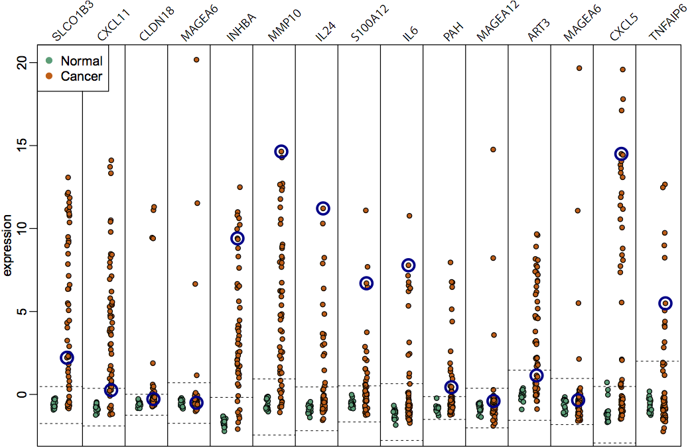

## Gene expression anti-profiles

- molecular methods for cancer detection, prognosis and treatment matching will be the basis of individualized medicine
- gene expression profile methods have been subject of study for decades
- very few proposed predictors are translated to the clinic
- one of the biggest culprits is lack of replicability of results in preliminary studies

---

_anti-profile score_: measures sample-specific deviation from normal expression in consistently hyper-variable genes

<footer class="source">BMC Bioinformatics, 2013</footer>

---

Anti-profile score distinguishes between stages in tumor progression

<footer class="source">Cancer Informatics, 2015</footer>

---

DNA methylation anti-profiles score distinguishes between stages in tumor progression

<footer class="source">Cancer Informatics, 2015</footer>

---

Stratification based on anti-profile score

<footer class="source">Cancer Informatics, 2015</footer>

---

Stratification of breast samples based on anti-profile score

<footer class="source">Cancer Informatics, 2015</footer>

## Anomaly Classification

>- Profiles learned based on hyper-variability show consistent behavior across tissues and across experiments in tumor prognosis and progression
>- Distinguish observations from two _anomalous_ groups (e.g., adenoma vs. tumor)
>- How can we incorporate the fact that we are classifying anomalies?
>- Incorporating normal samples when building anomaly predictors improves stability and prediction performance
>- Why (and when) is it worth doing that?
>- Using function approximation methods to study predictor stability

<footer class="source">BMC Bioinformatics, 2013, Cancer Informatics, 2015</footer>
