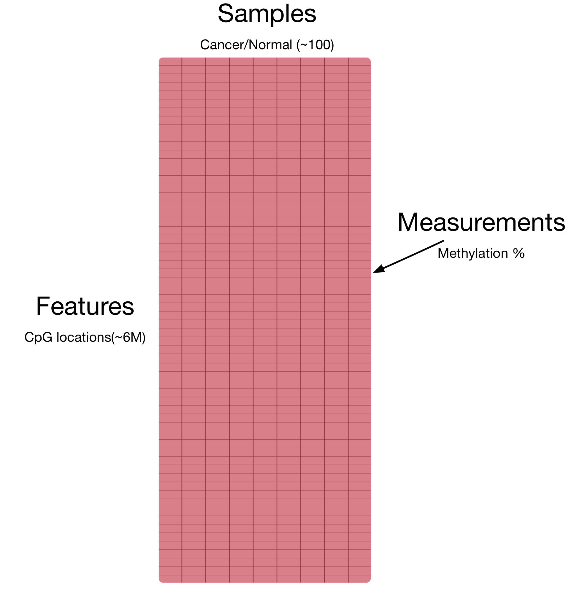
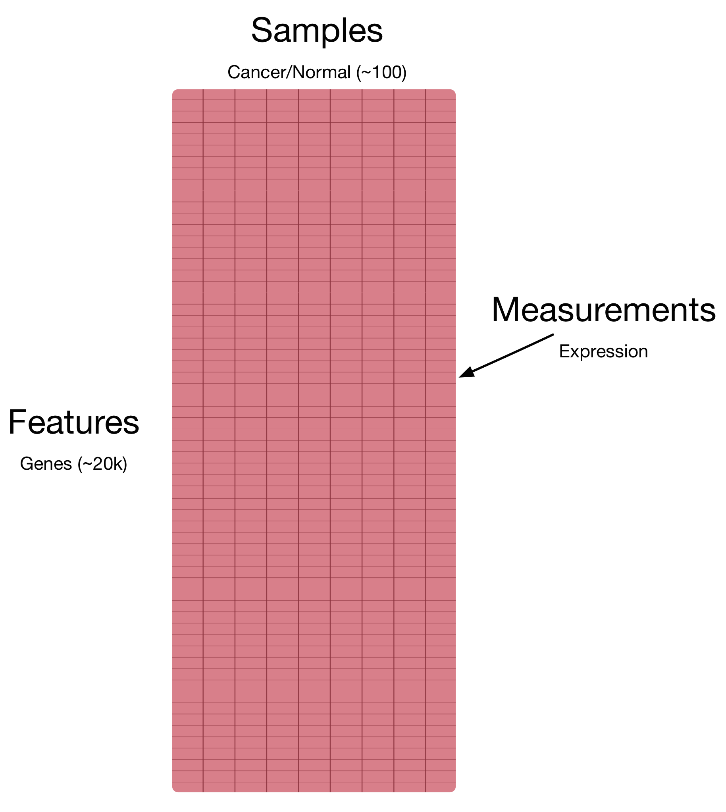

---

Much human variation is due to difference in ~6 million DNA base pairs (0.1% of genome)

- Phenotype, including disease susceptibility
- One led a fairly strict diet and regimen, had pancreatic cancer, the other did not
- While that gives a lot of information about the molecular basis of certain processes,
it is not the full story.

---

## Epigenomics and DNA methylation

Genes are **expressed** differently during different **stages** and in different **tissues**.

- Something that we want to understand is how that genetic variation leads to phenotypic variation.
- A major part of understanding that, comes from understanding how regulation works.

## Epigenomics and DNA methylation

DNA is packed, making certain parts inaccessible, and this packing is **dynamic**.

- DNA structure plays a major role

---

DNA methylation is a chemical modification of DNA, involved in *gene expression* regulation.

<footer class="source">[Robertson and Wolffe, Nat Rev Genet, 2000]</footer>

- DNA methylation plays a major role in this regulation process
- Plus, we know how it is inherited from cell to cell, cell-fate
- invovled in differentiation
- can give us an important idea of this process in development and disease
- plasticity

## Probing DNA methylation

## Probing DNA methylation

## The data

## The data

## The data

## DNA methylation in cancer

Large blocks of **hypo-methylation** in colon cancer

<footer class="source">Nat. Genetics, 2011</footer>

- long, 
- consistent but partially methylated in normal tissues
- while methylation levels are inconsistent in cancer, boundaries of these domains are conserved across tissues

- overlaps with other important genomic domains
- **tissue-specific** genes are over-represented within blocks

---

**Hypo-methylation** blocks observed across five solid tumor types.

<footer class="source">Genome Medicine, 2014</footer>

