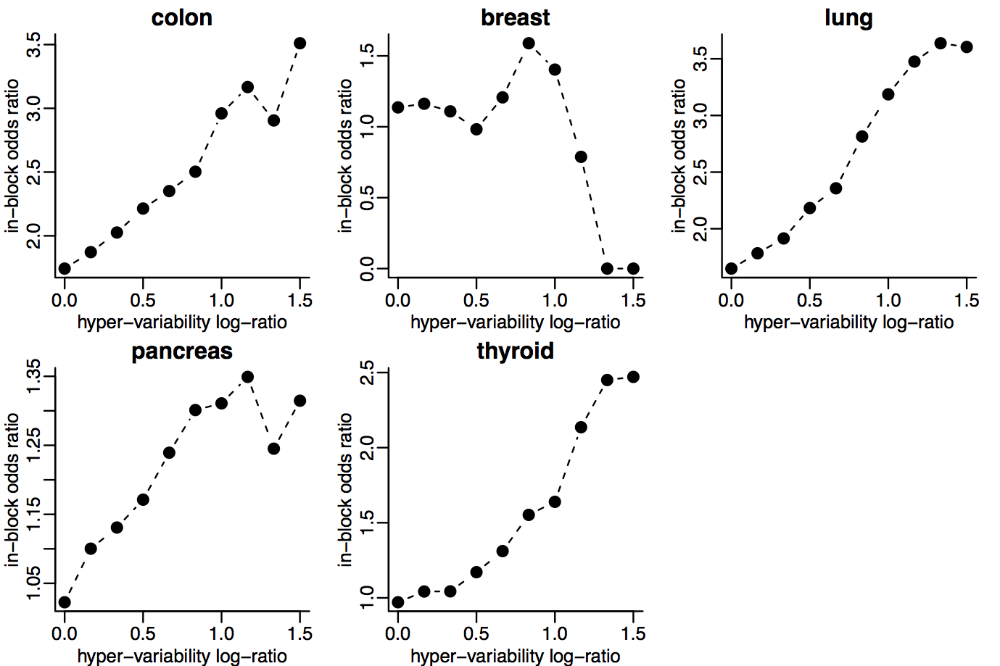

---

---

----

      
Genes with **hyper-variable** expression in colon cancer are enriched within these blocks.
    
<footer class="source">Nat. Genetics, 2011</footer>
      
----
      

          
Gene expression **hyper-variability** enriched in hypo-methylation blocks in other cancer types.
        
<footer class="source">Genome Medicine, 2014</footer>
          
----
          

                
Genes with **consistent hyper-variable expression** across tumors are _tissue-specific_.
              
<footer class="source">BMC Bioinformatics, 2013</footer>
                
              
              