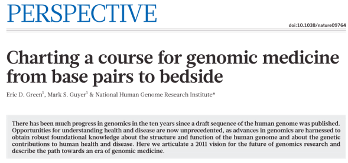

----

**What does my group do?**

- Study the **molecular** basis of *variation* in development and disease
- Using **high-throughput** experimental methods


## The genomic revolution

- For over a decade we have laid the basic molecular blueprint by **sequencing** DNA

<div class="centered">

</div>

----

**NHGRI strategic plan**

<div class="centered">

</div>

<footer class="source">[Nature, 2011]</footer>

----

**NHGRI strategic plan**

"The major bottleneck in genome sequencing is no longer **data generation**—the computational challenges around **data analysis**, display and integration are now rate limiting. New approaches and methods are required to meet these challenges."

- Data analysis 
- Data integration
- Visualization
- Computational tools and infrastructure

<footer class="source">[Nature, 2011]</footer>

----

My group's work as a simplex

<div class="centered">

</div>

# Computational Epigenomics

```{r child='epigenomics.Rmd', eval=FALSE }
```

```{r child='antiprofiles.Rmd', eval=FALSE }
```

```{r child='methylflow.Rmd', eval=FALSE }
```

## Moving forward

>- move anti-profiles closer to the clinic
>- explore _anomaly classification_ as a general learning setting
>- methods to understand hierarchical organization of epigenomic domains
>- better understand connection between intra-tumor heterogeneity and consistent hyper-variability in cancer

----

- Discoveries: consistent hypo-methylation, hyper-variability
- Methods: anomaly classification as a setting to understand predictor stability
- Tools

<div class="centered">

</div>


```{r child='epiviz.Rmd', eval=FALSE }
```


## Moving forward

- collaborative computational and visual analysis (w/ N. Elmqvist @ HCIL)
- effective visual methods to explore hierarchical organization of genome
- deeper integration of statistically-informed visualization
- visualization-informed statistical analysis

----

- Discoveries: consistent hypo-methylation, hyper-variability
- Methods: anomaly classification as a setting to understand predictor stability
- Tools: computational and visual exploratory genomic data analysis

<div class="centered">

</div>

## Metagenomics (mixed genomes)

```{r child="metagenomics.Rmd", eval=FALSE }
```

----

**NHGRI strategic plan**

"Meeting the computational challenges for genomics requires scientists with expertise in biology as well as in informatics, computer science, mathematics, statistics and/or engineering." 

_A new generation of investigators who are proficient in two or more of these fields must be trained and supported._

----

**Acknowledgements**  

Past members of HCBravo group  
_now at Harvard, U. Chicago, Johns Hopkins, Genentech, Dow Jones Data Science_

Colleagues at CBCB  
Current members of HCBravo group  
Collaborators at JHU/Harvard 

Funding: NIH, Genentech, Gates Foundation  

**More information**

[http://hcbravo.org](http://hcbravo.org)  
[\@hcorrada](https://twitter.com/hcorrada)    


