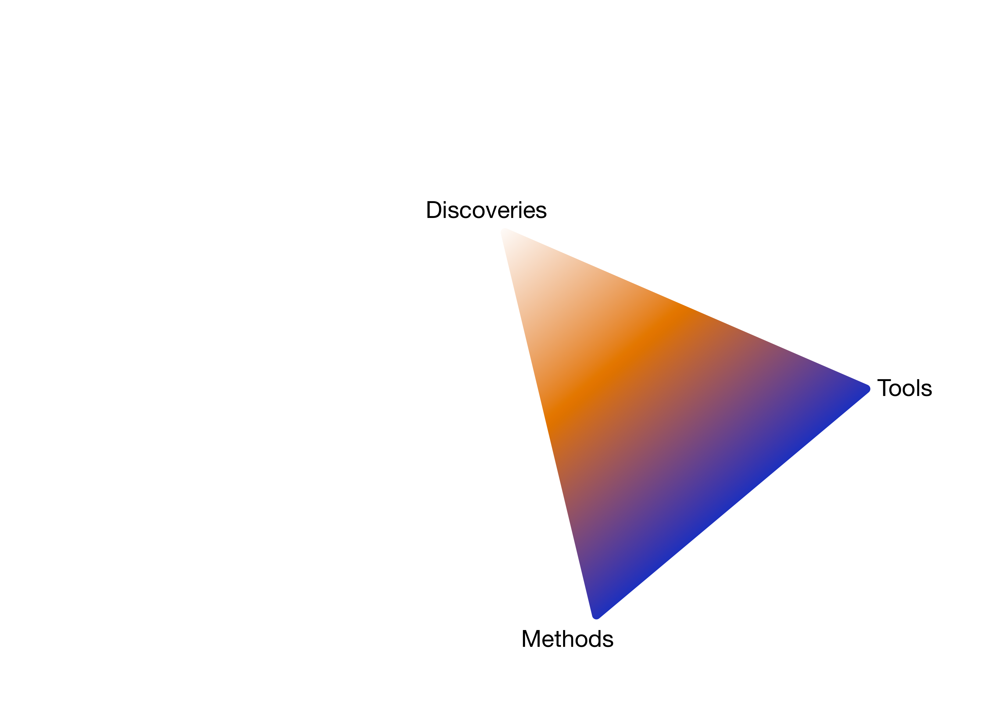
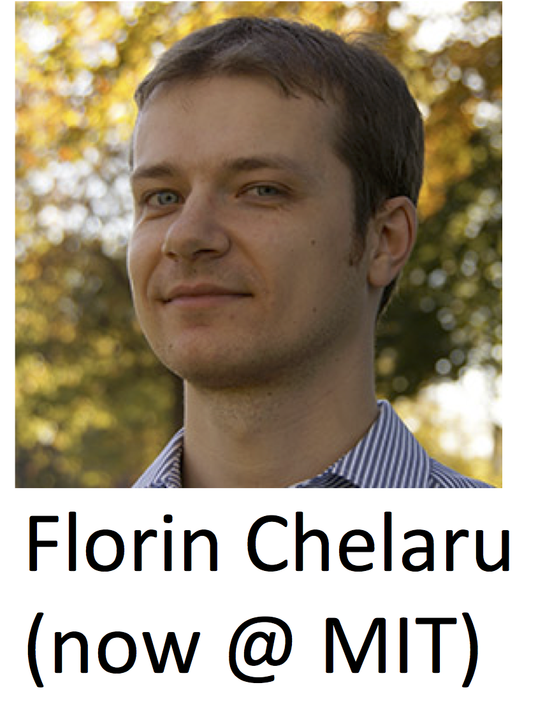

----

**Members from diverse disciplines**

- Computer Science
- Applied Statistics and Scientific Computation
- Computational Biology

**Central theme**

- Computational and statistical **method** and **tool** development
- Study the **molecular** basis of *variation* in development and disease
- Using **high-throughput** experimental methods


----

**Metagenomics**

- DNA sequencing of bacterial communities
- Method and tool development: `metagenomeSeq` Bioconductor package (Nat. Methods 2014)
- Large epidemiological study of childhood diahrrea in developing countries (Genome Biology 2015)

**Host-pathogen interaction**

- Joint RNA sequencing of parasite and host cell during course of infection (NAR 2015, PLOS Pathogens 2015)
- Novel methodology for RNA-seq normalization and differential expression analysis (Biostatistics 2015)

**Computational Epigenomics**

----

<div class="centered">

</div>

----

**NHGRI strategic plan**

<div class="centered">

</div>

<footer class="source">[Nature, 2011]</footer>

----

**NHGRI strategic plan**

> "The major **bottleneck** in genome sequencing is **no longer data generation**—the computational challenges around
> **data analysis, display and integration** are now rate limiting. New approaches and methods are required 
> to meet these challenges."

- Data analysis 
- Visualization
- Data integration
- Computational tools and infrastructure

<footer class="source">[Nature, 2011]</footer>

# Computational Epigenomics

```{r child='epigenomics.Rmd', eval=TRUE }
```

```{r child='methylflow.Rmd', eval=TRUE }
```

```{r child='epigenomics2.Rmd', eval=TRUE }
```

```{r child='antiprofiles.Rmd', eval=TRUE }
```

## Moving forward

>- Better understand connection between intra-tumor heterogeneity and consistent hyper-variability in cancer
>- How to understand population-level inferences from features (measurements) that are themselves _inferred_
>- Move anti-profiles closer to the clinic
>- Explore _anomaly classification_ as a general learning setting

----

- Discovery: consistent hypo-methylation and hyper-variability associated with progression and prognosis
- Methods: anomaly classification as a setting to understand predictor stability, methylation pattern reconstruction
- _Tools_

<div class="centered">

</div>


```{r child='epiviz.Rmd', eval=TRUE }
```


## Moving forward

>- Collaborative computational and visual analysis
>- Effective visual methods to explore hierarchical organization of (epi)-genome
>- Deeper integration of statistically-informed visualization
>- Visualization-informed statistical analysis

<div class="centered">

</div>

----

- Discoveries: consistent hypo-methylation, hyper-variability
- Methods: anomaly classification as a setting to understand predictor stability
- Tools: computational and visual exploratory genomic data analysis

<div class="centered">

</div>

```{r child="metagenomics.Rmd", eval=FALSE }
```

----

**NHGRI strategic plan**

> "Meeting the computational challenges for genomics requires scientists with expertise in biology as well as in informatics, computer science, mathematics, statistics and/or engineering." 

_A new generation of investigators who are proficient in two or more of these fields must be trained and supported._

Courses taught and/or created:

- Undergraduate Computational Biology: sequence analysis and beyond
- Graduate Functional Genomics
- Undergraduate Data Science

----

**Acknowledgements**  

Past members of HCBravo group  
_now at Harvard, U. Chicago, Johns Hopkins, Genentech, Dow Jones Data Science_

Colleagues at CBCB  
Current members of HCBravo group  
Collaborators at JHU/Harvard 

Funding: NIH, Genentech, Gates Foundation  

**More information**

[http://hcbravo.org](http://hcbravo.org)  
[\@hcorrada](https://twitter.com/hcorrada)    


