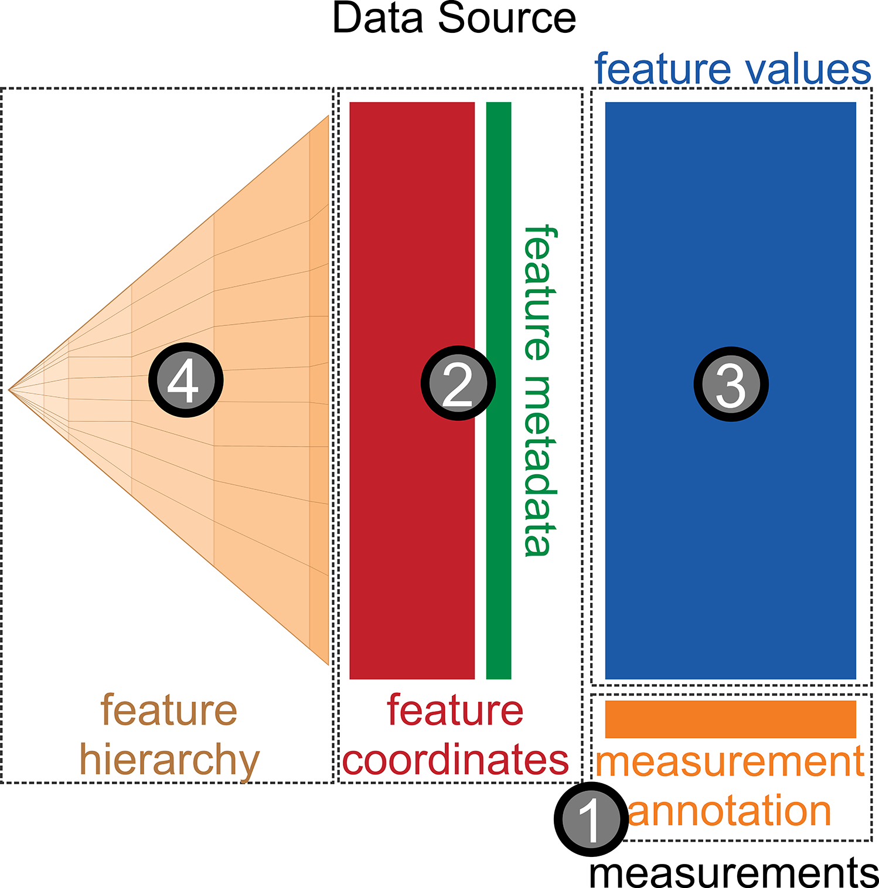

<footer class="source">[Human Microbiome Project]</footer>

## Metagenomics (mixed genomes)

- Discoveries: pathogenic associations for childhood diarrhea in developing world. (Genome Biology, 2014)
- Methods: association discovery for metagenomic communities. (Nature Methods, 2013)
- Tools: `metagenomeSeq`, `metagenomicFeatures`, `metaviz`

---

**Coordinates**:

---

**Samples**:

---

Hierachically organized features

---

Hierarchically organized features

<video height="500" controls>
  <source src="movies/metavizr1.mp4" type="video/mp4">
</video>

