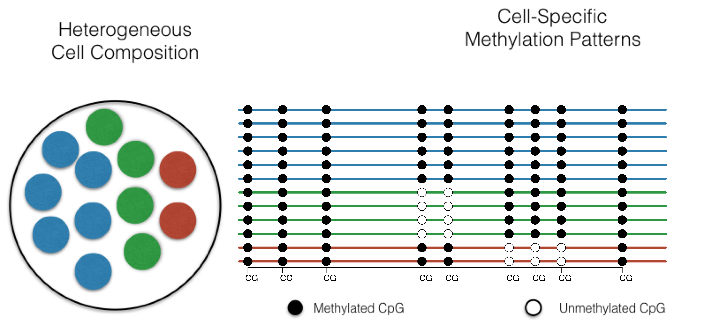
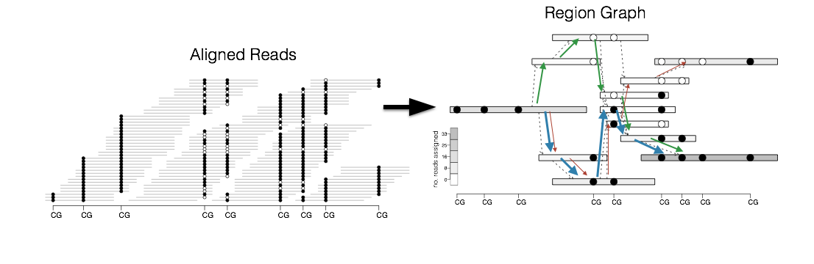
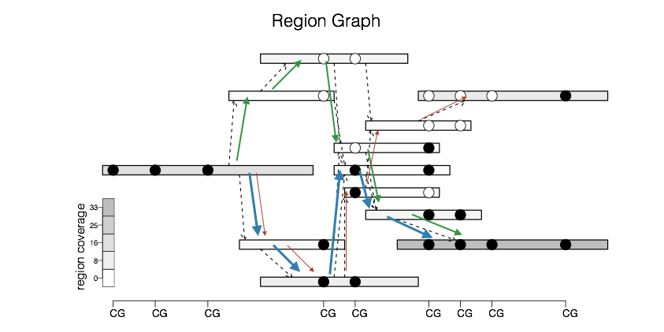
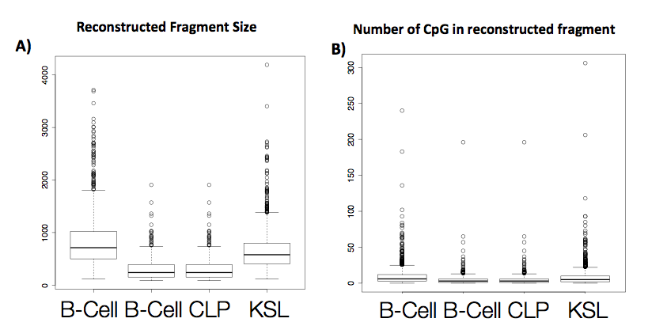
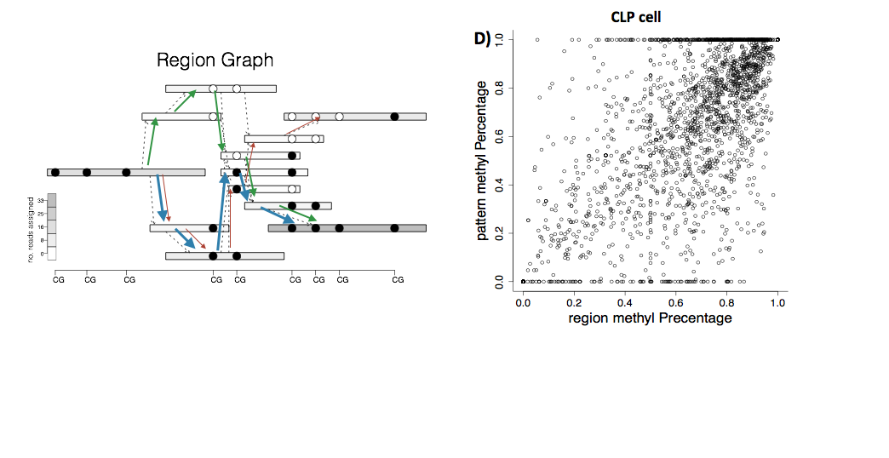
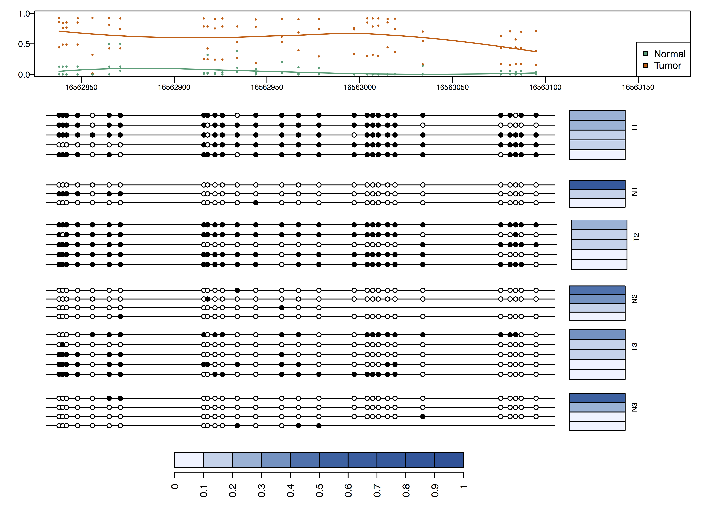

## This is a *heterogeneous* cell population

## This is a *heterogeneous* cell population

----

**Methylation pattern reconstruction problem**

`methylFlow`: [http://github.com/hcorrada/methylFlow](http://github.com/methylFlow)

<footer class="source">[Bioinformatics, in press]</footer>

----

**Methylation pattern reconstruction problem**

- Given a set of mapped reads

----

**Methylation pattern reconstruction problem**

- Given a set of mapped reads
- Determine _composition_ of cell-specific methylation patterns

---

**Methylation pattern reconstruction problem**

----

**The statistic: number of reads in genomic region**

- regions (vertices) defined by overlapping reads with _consistent_ methylation patterns
- overlaps (edges) defined by overlapping reads with _inconsistent_ methylation patterns
- region _coverage_: total number of reads originating in region

---

**The model: expected number of reads in genomic region**

$$
\mathbb{E} y_v = \sum_{u:(v,u) |in E} \ell_{vu} \sum_{p:(v,u)\in p} \theta_p
$$

---

**The estimator**

- Penalized method of moments:
  - number of parameters = number of paths through graph
  - sparsity inducing penalty to obtain solution with small number of patterns
  
$$
\min_{\theta_p} \sum_v \lvert y_v - \sum_{u:(v,u)\in E} \ell_{vu} \sum_{p:(v,u)\in p} \theta_p \rvert + \lambda \sum_p \lvert \theta_p \rvert
$$

---

**How to solve efficiently**

$$
\min_{\theta_p} \sum_v \lvert y_v - \sum_{u:(v,u)\in E} \ell_{vu} \sum_{p:(v,u)\in p} \theta_p \rvert + \lambda \sum_p \lvert \theta_p \rvert
$$

If we interpret _abundance_ as _path flow_, then we can rewrite in terms of _edge flows_

$$
f_{vu} = \sum_{p:(v,u) \in p} \theta_p
$$

---

**How to solve efficiently**

$$
\min_{\theta_p} \sum_v \lvert y_v - \sum_{u:(v,u)\in E} \ell_{vu} \sum_{p:(v,u)\in p} \theta_p \rvert + \lambda \sum_p \lvert \theta_p \rvert
$$

If we interpret _abundance_ as _path flow_, then we can rewrite in terms of _edge flows_

$$
f_{vu} = \sum_{p:(v,u) \in p} \theta_p
$$

$$
\min_{f \geq 0} \sum_v \lvert y_v - \sum_{u:(v,u)\in E} \ell_{vu} f_{vu} \rvert + \lambda f_{vt} \\
\textrm{s.t} \sum_{u:(v,u) \in E} f_{vu} = \sum_{w:(w,v) \in E} f_{wv}
$$

----

**How to solve efficiently**

$$
\min_{f \geq 0} \sum_v \lvert y_v - \sum_{u:(v,u)\in E} \ell_{vu} f_{vu} \rvert + \lambda f_{vt} \\
\textrm{s.t} \sum_{u:(v,u) \in E} f_{vu} = \sum_{w:(w,v) \in E} f_{wv}
$$

- This is a _linear optimization problem_ (LP)
- We can solve efficiently for very large problems
- Final solution obtained by _path flow_ decomposition

----

**Pattern reconstruction from whole genome bisulfite sequencing**

Dataset of 50bp reads from mouse wild-type activated B cells, two types of progenitor cells (CLP and KSL).

_Reconstruct patterns 4-100x basepair length_

----

**Pattern reconstruction from whole genome bisulfite sequencing**

_Reconstruct patterns with accurate marginal estimates_

---

**Pattern reconstruction from targeted bisulfite sequencing**

_Compare patterns across samples and populations_

## Moving Forward

- We are now able to estimate methylation pattern composition for a single sample (e.g., normal or tumor)
- How to detect differences between cell populations:
    + For paired normal-tumor data, find genomic regions where methylation pattern composition changes (significantly)?
    + For samples across developmental course, how does composition change as differentiation occurs?
- How should we think about population-level inferences from measurements that are themselves _inferred_?

## Cell-specific methylation pattern reconstruction

- New view into molecular profiling
    + Complex relationship between cell-to-cell differences and average methylation differences
    + Complementary to single-cell bisulfite sequencing
- Efficient formulation as network flow problem
    + Exploring relationship to stochastic optimization
- Code: [https://github.com/hcorrada/methylFlow/](https://github.com/hcorrada/methylFlow/)
    + Includes incipient R package to parse and analyze resulting data
    + Takes SAM/BAM file input from Bismark and BSMap
    + Happy to collaborate on new analysis if you want to try it out
- Why do we care about intra-tumor heterogeneity?

